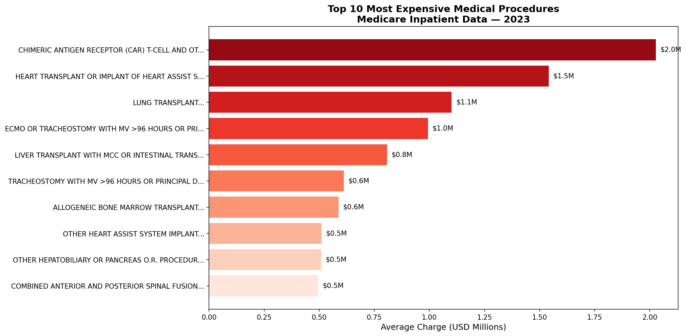
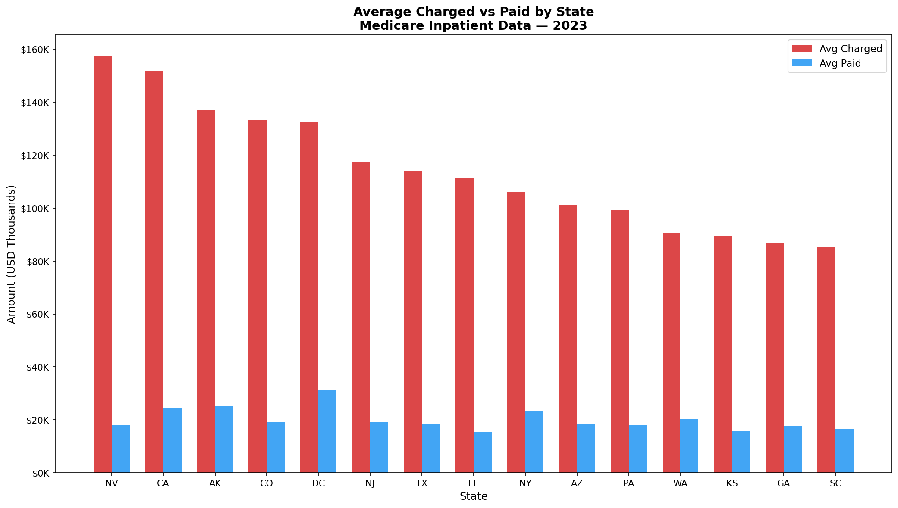
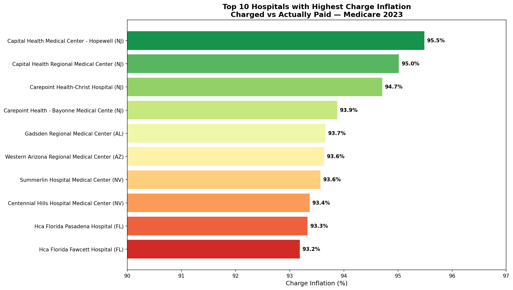
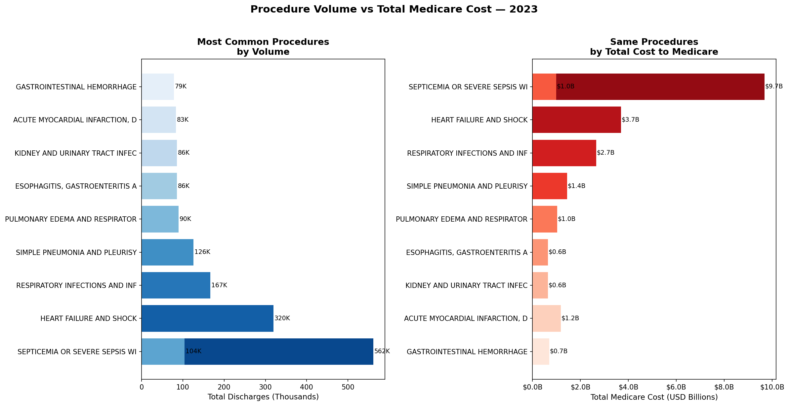

# Healthcare Claims Analysis
### Medicare Inpatient Data — United States, 2023


---

## Problem Statement

The US Medicare system processes millions of inpatient claims annually, 
representing hundreds of billions in healthcare spending. This project analyzes 
**146,427 records** across all US states to answer three core business questions:

1. Which medical procedures drive the highest costs in the system?
2. Which states and hospitals show the largest gap between billed and paid amounts?
3. Which procedures represent the highest total financial burden to Medicare?

---

## Dataset

| Field | Detail |
|---|---|
| Source | [CMS Medicare Inpatient Hospitals](https://data.cms.gov) |
| Year | 2023 (Released 2025) |
| Records | 146,427 |
| Coverage | All US states and territories |
| Key fields | Provider, DRG procedure, discharges, charges, payments |

---

## Tools Used

- **Python 3.13** — data processing and analysis
- **Pandas** — data manipulation and aggregation
- **Matplotlib / Seaborn** — data visualization
- **SQLite / DBeaver** — SQL query validation
- **Jupyter Notebook** — exploratory analysis
- **Git / GitHub** — version control

> All results were validated across both Python/Pandas and SQL/SQLite, confirming consistency in the analysis pipeline.

---

## Key Findings

### 1. Procedure Cost
- **CAR T-Cell therapy** is the most expensive procedure at **$2M average charge**
- Top 10 procedures are dominated by transplants, ECMO, and advanced oncology
- A clear cost cliff separates the top 3 from the remaining procedures

### 2. State-Level Pricing Gap
- **Nevada** has the highest average charge at **$157K** — but Medicare pays only **$17K**
- Every state shows a charge-to-payment gap of **5x to 8x**
- New Jersey, California, and Alaska consistently appear in the highest-cost states

### 3. Hospital Charge Inflation
- **Carepoint Health-Christ Hospital (NJ)** charges **$414K** on average but receives **$22K** — a **94.7% inflation rate**
- The top 10 hospitals with highest inflation are concentrated in NJ, NV, and FL
- This pattern reflects the US chargemaster pricing strategy, not necessarily fraud

### 4. Volume vs Total Cost
- **Septicemia (severe sepsis)** is both the most common procedure (561K discharges) 
  and the most costly to Medicare at **$9.7 billion annually**
- Heart Failure ranks 2nd in volume and cost at **$3.7B**
- High-volume, moderate-cost procedures generate more total spend than rare, 
  expensive ones

---

## Analytical Note

This analysis does not conclude that hospitals are overcharging. The US healthcare 
system uses a chargemaster pricing model where hospitals set internal list prices 
that serve as negotiation anchors — no payer ever pays the full rate. Medicare 
reimburses based on fixed DRG rates set by the government, which may not reflect 
actual care costs. A complete fairness assessment would require cost-of-care data 
beyond what is publicly available in this dataset.

---

## Visualizations

### Top 10 Most Expensive Procedures


### Average Charged vs Paid by State


### Hospital Charge Inflation


### Procedure Volume vs Total Medicare Cost


---

## Repository Structure
```
healthcare-claims-analysis/
├── data/
│   ├── raw/                  # Original CMS dataset
│   └── processed/            # Cleaned data
├── notebooks/
│   └── 01_exploratory_analysis.ipynb
├── docs/                     # Charts and visualizations
└── README.md
```

---

## About

Analysis developed by **Raiane Camara** as part of a Data Analytics portfolio.  
Background in healthcare operations, insurance, and financial services.

[](www.linkedin.com/in/raianecostacamara)